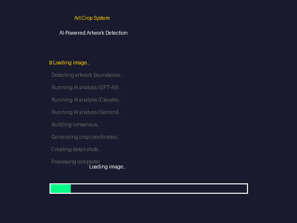

# Art Crop System


**AI-powered artwork detection and cropping - automatically extract art from photos with perfect borders.**



---

## What Does This Do?

When you photograph artwork, you get the frame, wall, shadows, etc. This tool:

1. **Detects the artwork** in your photo using AI vision
2. **Finds the exact edges** of the art piece
3. **Crops perfectly** - no extra background
4. **Generates detail shots** - corners, signature, texture
5. **Validates quality** - checks for blur, lighting, angle issues

**Before:** Photo of framed art on a wall
**After:** Clean, perfectly cropped artwork image + 8 detail shots

---

## Quick Start

```bash
# Clone the repo
git clone https://github.com/jjshay/art-crop-system.git
cd art-crop-system

# Install dependencies
pip install -r requirements.txt

# Run the interactive demo
python demo.py

# Or run the visual showcase
python showcase.py

# Crop sample wall photo
python ai_art_crop_system.py examples/wall_photo.jpg --output output/
```

### Sample Files
- `examples/wall_photo.jpg` - Photo of artwork on wall (ready to crop!)
- `examples/crop_config.json` - Configuration options
- `sample_output/crop_report.json` - Example detection results

---

## How It Works

```
Original Photo (art on wall)
         │
         ▼
┌─────────────────────────────────────────┐
│        TIER 1: rembg (Fast)             │
│  Background removal for initial crop     │
└─────────────────────────────────────────┘
         │
         ▼
┌─────────────────────────────────────────┐
│     TIER 2: Multi-AI Vision Analysis     │
│  GPT-4V + Claude + Gemini + Grok        │
│  Consensus on exact artwork boundaries   │
└─────────────────────────────────────────┘
         │
         ▼
┌─────────────────────────────────────────┐
│      TIER 3: CV Edge Detection          │
│  OpenCV fallback for edge cases         │
└─────────────────────────────────────────┘
         │
         ▼
┌─────────────────────────────────────────┐
│         TIER 4: Quality Check           │
│  Blur detection, lighting, angle        │
└─────────────────────────────────────────┘
         │
         ▼
  Perfect Crop + Detail Shots
```

---

## Output: 8 Detail Shots

For each artwork, the system generates:

| Shot | Shows |
|------|-------|
| Full | Complete artwork |
| Top-Left | Upper left corner detail |
| Top-Right | Upper right corner detail |
| Bottom-Left | Lower left corner + signature area |
| Bottom-Right | Lower right corner |
| Center | Central detail/texture |
| Signature | Detected signature closeup |
| Edition | Edition number if present |

---

## Features

- **Multi-AI Consensus**: Uses 4 AI models to agree on crop boundaries
- **Signature Detection**: Automatically finds and highlights artist signatures
- **Edition Number Detection**: Locates "23/100" style edition markings
- **Quality Scoring**: Rates image quality (lighting, focus, angle)
- **Batch Processing**: Process entire folders automatically
- **Google Drive Integration**: Upload results directly to Drive

---

## Setup

### Basic (No AI)
```bash
pip install -r requirements.txt
python demo.py  # Uses rembg only
```

### Full AI Mode
```bash
# Copy and configure .env
cp .env.example .env
nano .env

# Add your API keys
OPENAI_API_KEY=sk-...
ANTHROPIC_API_KEY=sk-ant-...
GOOGLE_API_KEY=AIza...
```

---

## Files

| File | Purpose |
|------|---------|
| `ai_art_crop_system.py` | Main multi-tier cropping system |
| `gdrive_gallery_quality_crops.py` | Google Drive integration |
| `crop_quality_validator.py` | Image quality assessment |
| `art_crop_pipeline_final.py` | Production pipeline |
| `demo.py` | Demo without API keys |

---

## License

MIT - Use freely for your artwork processing!
