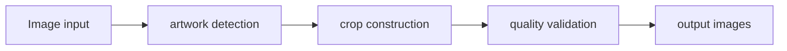

# Art Crop System — Project Brief

## At a glance

| Field | Value |
|---|---|
| Portfolio area | Creative tooling |
| Repository | [jjshay/art-crop-system](https://github.com/jjshay/art-crop-system) |
| Status | Source available; runtime not revalidated in this documentation review |
| Evidence review | 2026-09-11; [commit a09ebf2](https://github.com/jjshay/art-crop-system/tree/a09ebf27dbb8b7f8a2b782bc94742c40e2d9305c) |

## Problem and intended value

Artwork photography needs consistent full-frame and detail crops for listing presentation.

The intended value is a repeatable workflow whose inputs, transformations, and outputs can be inspected. Use the evidence below to distinguish implementation from business outcomes.

## Architecture and data flow

Image input → artwork detection → crop construction → quality validation → output images.

## Implementation evidence

| Source | Reading purpose |
|---|---|
| [ai_art_crop_system.py](../ai_art_crop_system.py) | Implementation component supporting the data flow described above. |
| [crop_quality_validator.py](../crop_quality_validator.py) | Implementation component supporting the data flow described above. |
| [tests/test_crop_system.py](../tests/test_crop_system.py) | Behavioral test source; inspect fixtures and assertions before interpreting coverage. |

The links above point to the current repository. The review reference identifies the version used to prepare this brief.

## Setup and operation

Use the existing [README](../README.md) for setup and operating commands. Configuration and dependency references: [requirements.txt](../requirements.txt), [pyproject.toml](../pyproject.toml), [.env.example](../.env.example).

Start with sample or fixture inputs. Where external services are involved, configure a test account and check the distinction between a local preview, a generated artifact, and a remote write. Credentials and operational datasets are environment-specific.

## Validation and outcomes

**Review result:** Repository tree and referenced source reviewed. Existing application tests, hosted deployments, paid providers, and external mutations were not re-run in this documentation review.

Test sources found: [tests/test_crop_system.py](../tests/test_crop_system.py). Their presence does not mean the suite was run in this review.

The source implements the workflow described above. No new revenue, accuracy, conversion, or production-uptime result is asserted by this documentation update.

Documentation itself is checked by `python3 scripts/check_project_docs.py`; that check validates this structure and its source references, not application behavior.

## Decisions and limitations

Vision-assisted detection expands coverage but difficult frames and backgrounds need a quality gate.

Keep provider-dependent observations dated and separate from deterministic transformations. State which assumptions a demonstration uses and which integrations it actually exercises.

## Interview talking points

- **Problem and product judgment:** Explain why this workflow mattered to its intended operator: Artwork photography needs consistent full-frame and detail crops for listing presentation.
- **Technical walkthrough:** Trace one concrete input through this sequence: Image input → artwork detection → crop construction → quality validation → output images.
- **Engineering tradeoff:** Vision-assisted detection expands coverage but difficult frames and backgrounds need a quality gate.
- **Evidence and ownership:** Open the source links above, identify the specific design or implementation decisions you personally drove, and distinguish AI-assisted implementation from measured operating results.
- **What comes next:** Benchmark boundary accuracy on varied frames and backgrounds and preserve rejected examples for review.

## Next improvements

Benchmark boundary accuracy on varied frames and backgrounds and preserve rejected examples for review.

Record any follow-up result with a date, exact command or evaluation method, input scope, observed output, and limitations. Update `project.json` alongside this brief.

## Related projects

- [Art Print Manager](https://github.com/jjshay/ArtPrint) — Creative tooling.
- [AirDrop Photo Pipeline](https://github.com/jjshay/airdrop-processor) — Creative tooling.
- [Art Video Overlay](https://github.com/jjshay/art-video-project) — Creative tooling.
- [Handwriting Analysis Prototype](https://github.com/jjshay/handwriting-analysis) — Creative tooling.
- [Artwork Mockup Generator](https://github.com/jjshay/mockup-generator) — Creative tooling.

Some related repositories require authorized GitHub access.
